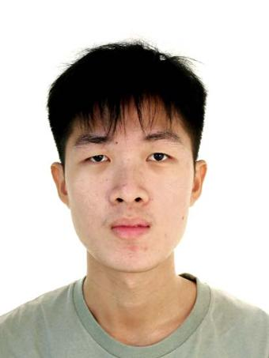
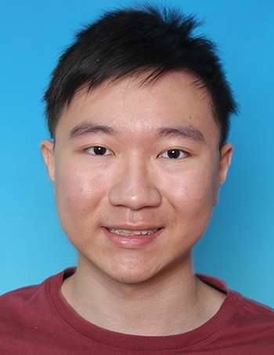
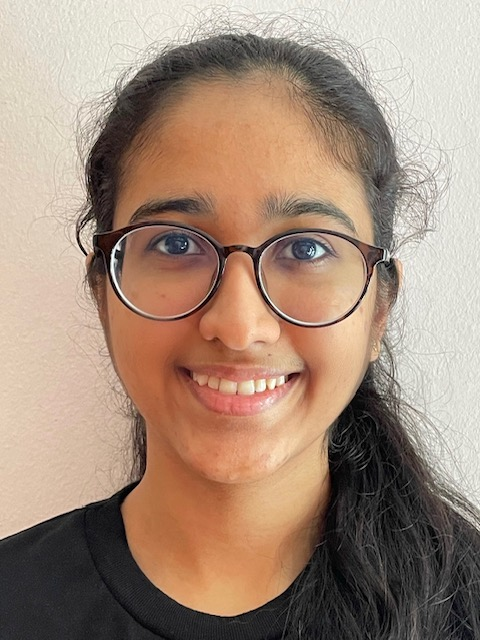

# About Us

We are a team based in the [School of Computing, National University of Singapore](http://www.comp.nus.edu.sg).

You can reach us at the email `seer[at]comp.nus.edu.sg`

## Project team

### Tan Tze Young

[[github](http://github.com/ItsTYtan)]
[[portfolio](team/itstytan.md)]

* Role: Team Lead
* Responsibilities: UI

### Toh Li Yuan

[[github](http://github.com/TohLiYuan)] [[portfolio](team/tohliyuan.md)]

* Role: Developer
* Responsibilities: Storage

### Thaddeus Ong

[[github](http://github.com/thaddeusong)]
[[portfolio](team/thaddeusong.md)]

* Role: Developer
* Responsibilities: Logic and Model

### Seah Zi Xiang

[[github](http://github.com/prawnzyy)]
[[portfolio](team/prawnzyy.md)]

* Role: Developer
* Responsibilities: Admin and UI

### Dhruvi Ketan Rathod

[[github](http://github.com/dhruvir29)]
[[portfolio](team/dhruvir29.md)]

* Role: Developer
* Responsibilities: Logic