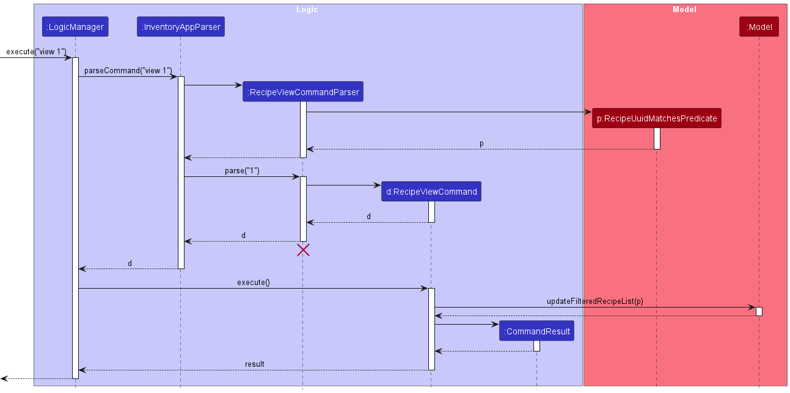
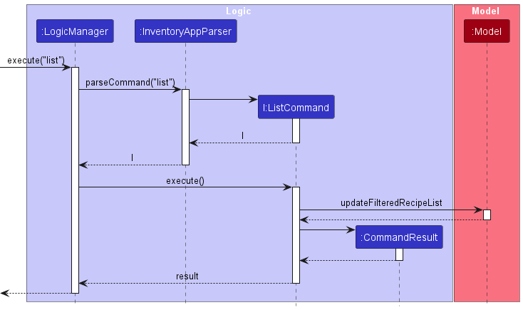
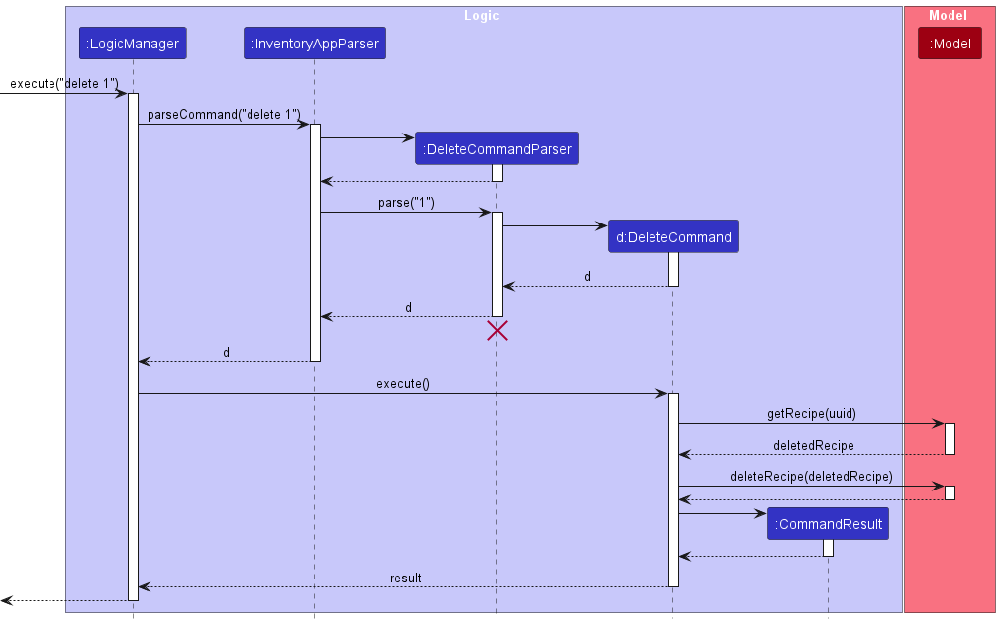

## Implementation
This section describes some noteworthy details on how certain features are implemented.

### View recipe feature
#### Implementation
The view recipe mechanism is implemented as a `Command`, extending from the `command` abstract class.

Given below is an example usage scenario and how the view recipe mechanism behaves at each step. The application is
assumed to be initialised with at least one recipe loaded in the `ModelManager`.

Step 1. The user keys in `view 1` into the UI command box. `LogicManager` takes this string command and executes it.

Step 2. `InventoryAppParser` is then called to parse the `view 1` command.

Step 3. By Polymorphism, `RecipeViewCommandParser` is called on to handle the parsing. The `parse(String args)` function
is called with the argument of `"1"`

Step 4. A `RecipeUuidMatchesPredicate` predicate object is created which returns true for any recipe tested on the
predicate with the same uuid of `"1"`.

Step 5. The `RecipeViewCommand` then filters the recipe list in `ModelManager` according to the predicate. The recipe
list should only have at most 1 item after filtration.

Step 6. The `MainWindow` in `ui` detects that there is one item in the recipe list, and proceeds to display the full
recipe.

`RecipeViewCommand` calls `Model#updateFilteredRecipeList(Predicate<Recipe> predicate)`, filtering the
recipe list in `ModelManager` according to the predicate set.

The following sequence diagram shows how the view recipe operation works:

#### Alternatives considered:
An alternative implementation of the recipe view command would be to find the first recipe with uuid that matches
instead of filtering through the whole recipe list. Each recipe has a unique id, and hence the first instance of a
recipe with match uuid should be the only recipe with that uuid. This could lead to faster search times to view
a specific recipe.

However, we do not expect a user to have so many recipes that performance would become an issue. We do not expect
users to be frequently using this command either, since baking something requires much time and effort. Filtering
through the whole list also confers an advantage of being able to assert that there is at most one such recipe
with that particular uuid.

### List recipe feature
#### Implementation
The List feature is implemented as a type of `Command`. It extends the abstract class `Command`.

Given below is an example usage scenario and how the list feature behaves at each step. The recipe storage is assumed to
be initialised with at least 2 recipes within `ModelManager`.

Step 1. The user launches the application. All recipes will be shown as the current recipeList has not been filtered.

Step 2. The user executes `view 1`. The `view` command will then update the recipeList to only contain the filtered
recipe.

Step 3. The user then executes `list`. The `list` command will be parsed using the `Inventory App Parser` within
`LogicManager`.

Step 4. This parsed command will be executed once again with `LogicManager`.

Step 5. During execution, `ModelManager#updateFilteredRecipeList` will be called with the `PREDICATE_SHOW_ALL_RECIPES`
to update the current recipeList with all the recipes.

Step 6. After execution, the returned `CommandResult` will then be returned back to the `MainWindow` to be displayed.

The following sequence diagram shows how the list recipe feature works:

### Design Considerations:
**Aspect : How view executes:**
- Alternative 1 (Current Choice): Gets the list from the "RecipeBook"
  - Pro: Easy to implement
  - Con: Need to constantly store current state
- Alternative 2: Read the list from the storage
  - Pro: No need to store current state after command
  - Con: Need to access storage

### Delete recipe feature
#### Implementation
The delete recipe mechanism is implemented as a `Command`, extending from the `command` abstract class.

Given below is an example usage scenario and how the delete recipe mechanism behaves at each step. The application is
assumed to be initialised with at least one recipe loaded in the `ModelManager`.

Step 1. The user keys in `delete 1` into the UI command box. `LogicManager` takes this string command and executes it.

Step 2. `InventoryAppParser` is then called to parse the `delete 1` command.

Step 3. By Polymorphism, `DeleteCommandParser` is called on to handle the parsing. The `parse(String args)` function is 
called with the argument of "1" and the "1" is parsed as an `Index`.

Step 4: This results in the creation of a `DeleteCommand` object with the index as a parameter.

Step 5: This `DeleteCommand` object is then executed by the `LogicManager`.

Step 6: During execution, the recipe whose uuid matches with the index passed in is retrieved from the list of 
recipes and the `ModelManager#deleteRecipe(Recipe recipe)` will be called with this recipe, causing the recipe to be 
deleted from the recipe list.

**Note**: If the argument is an invalid index (less than 0 or more than the size of the current list), a 
`CommandException` will be thrown and users will be informed that they inputted an invalid index.

The following sequence diagram shows how the DeleteCommand works:

**Note**: The lifeline for `DeleteCommandParser` should end at the destroy marker (X) but due to a limitation of PlantUML, 
the lifeline reaches the end of diagram.

## **Appendix: Requirements**

### Product Scope

**Target User Profile**

- is a home-baker
- has a need to manage and use their inventory of ingredients
- has a need to manage a significant amount of recipes and view the ingredients needed
- is reasonably comfortable using CLI apps
- prefer desktop apps over other types
- can type fast

**Value Propositions**

Home-bakers often struggle with managing their recipe book as well as checking if they have the ingredients needed for
a particular recipe. This application is designed for home-bakers to search for the recipes that they want along with
the necessary ingredients required to make baking a more convenient and easy process.

**User Stories**

Priorities: High (must have) - `***`, Medium (nice to have) - `**`, Low (unlikely to have) - `*`

| Priority | As a... |                              I want to ... | So that I can ...                                |
|:---------|:-------:|-------------------------------------------:|--------------------------------------------------|
| `***`    |  baker  |                              view my stock | know what and the quantity of ingredients I have |
| `***`    |  baker  |                add ingredients to my stock | update the stock I have                          |
| `***`    |  baker  | reduce ingredients' quantities in my stock | update the stock I have after I used the items   |
| `***`    |  baker  |                             clear my stock | have an empty stock                              |
| `***`    |  baker  |                       find recipes by name | find a specific recipe                           |
| `***`    |  baker  |                               view recipes | see the steps and ingredients involved           |
| `***`    |  baker  |             add recipes to the recipe book | add new recipes in my recipe book                |
| `***`    |  baker  |        delete recipes from the recipe book | delete recipes I no longer need                  |
| `**`     |  baker  |                             modify recipes | make changes to the recipes as required          |
| `***`    |  baker  |   view the ingredients needed for a recipe | know if I have the necessary ingredients         |
| `***`    |  baker  |                           request for help | learn how to use the recipe book when I'm lost   |

{More to be added}

### Use Cases
(For all use cases below, the System is the RecipeBook and the Actor is the user, unless specified otherwise)

#### Use case: Add an ingredient to the stock
#### MSS
1. User requests to add a specific ingredient to their stock
2. RecipeBook adds that ingredient to the stock

   Use case ends.

#### Extensions
- 2a. User does not specify the quantity of that ingredient
  - RecipeBook shows an error message
- 2b. The name of the ingredient is not recognised
  - RecipeBook shows an error message
- 2c. The specified unit is not recognised
  - RecipeBook shows an error message

#### Use case: Reduce items' quantities in the stock
#### MSS
1. User requests to use up specific quantities of an ingredient
2. RecipeBook reduces the quantity of that ingredient in the stock

   Use case ends.

#### Extensions
- 2a. User does not specify the quantity of that ingredient used
    - RecipeBook depletes the entire quantity of that ingredient
- 2b. The quantity the user requests to use is more than the current quantity in stock
    - RecipeBook depletes the entire quantity of that ingredient
- 2c. The specified unit is not recognised
    - RecipeBook shows an error message

#### Use case: View the stock of ingredients
#### MSS
1. User requests to view the stock of specific ingredients
2. RecipeBook shows the ingredient and the quantity of the ingredient

   Use case ends.

#### Extensions
- 2a. User does not specify what ingredients they would like to view
  - RecipeBook shows the entire stock of ingredients
- 2b. The specified ingredient(s) are not in the stock
  - RecipeBook shows an error message

#### Use case: Find a specific recipe
#### MSS
1. User requests to view a specific recipe
2. RecipeBook shows the corresponding recipe

   Use case ends.

#### Extensions
- 2a. The specified recipe does not exist
  - RecipeBook shows an error message

#### Use case: View all recipes
#### MSS
1. User requests to list all possible recipes
2. RecipeBook lists out all possible recipes

   Use case ends.

#### Extensions
- 2a. There is only one recipe
  - The recipe will be displayed in full, inclusive of steps
- 2b. There are multiple recipes
  - The recipes will only have their name and required ingredients listed
- 2c. There are currently no recipes stored
  - No updates will be made to the screen

#### Use case: Delete a recipe from the recipe list.
##### MSS
1. User requests to delete a specific recipe.
2. RecipeBook deletes the corresponding recipe.

   Use case ends.

#### Extensions:
- 2a. The specified recipe does not exist. 
  - RecipeBook shows an error message.

### Non-Functional Requirements

1. The system should work on any *mainstream* OS as long as it has Java `11` installed.
2. The system should be able to hold 500 ingredients and recipes in total without any noticeable sluggishness.
3. The system should be usable by any novice who is not familiar with computer programs.
4. The system should be understandable by any novice who is not familiar with baking.
5. The system should log error messages for user debugging & bug reporting purposes.
6. The system should be well-documented for future extension and maintainability.
7. The system should be backwards-compatible with data from older versions.

### Glossary
- Mainstream OS: Windows, Linux, OS-X
