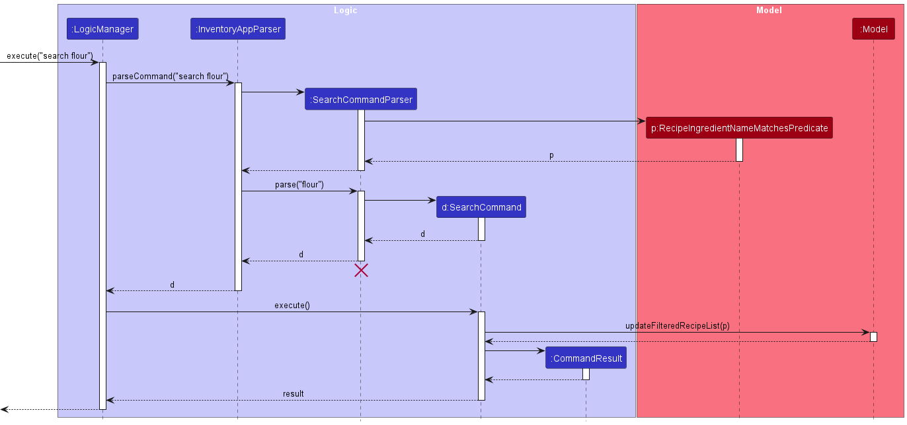
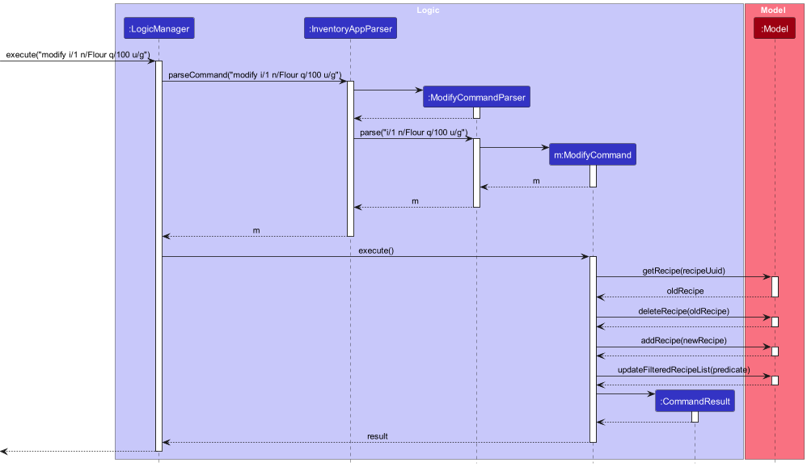

# [Ba]king [Br]ead Developer Guide

<!-- * Table of Contents -->
<page-nav-print />

--------------------------------------------------------------------------------------------------------------------

## **Acknowledgements**
This project is based on the [AddressBook-Level3](https://se-education.org/addressbook-level3/) project created by the 
[SE-EDU initiative](se-education.org).

--------------------------------------------------------------------------------------------------------------------

## **Setting up, getting started**

Refer to the guide [_Setting up and getting started_](SettingUp.md).

--------------------------------------------------------------------------------------------------------------------
## **Design**

### Architecture

<puml src="diagrams/ArchitectureDiagram.puml" width="280" />

The ***Architecture Diagram*** given above explains the high-level design of the App.

Given below is a quick overview of main components and how they interact with each other.

**Main components of the architecture**

**`Main`** (consisting of classes 
[`Main`](https://github.com/AY2324S1-CS2103T-F10-3/tp/blob/master/src/main/java/seedu/address/Main.java) and 
[`MainApp`](https://github.com/AY2324S1-CS2103T-F10-3/tp/blob/master/src/main/java/seedu/address/MainApp.java)) is in 
charge of the app launch and shut down.
* At app launch, it initializes the other components in the correct sequence, and connects them up with each other.
* At shut down, it shuts down the other components and invokes cleanup methods where necessary.

The bulk of the app's work is done by the following four components:

* [**`UI`**](#ui-component): The UI of the App.
* [**`Logic`**](#logic-component): The command executor.
* [**`Model`**](#model-component): Holds the data of the App in memory.
* [**`Storage`**](#storage-component): Reads data from, and writes data to, the hard disk.

[**`Commons`**](#common-classes) represents a collection of classes used by multiple other components.

**How the architecture components interact with each other**

The *Sequence Diagram* below shows how the components interact with each other for the scenario where the user issues the command `delete 1`.

<puml src="diagrams/ArchitectureSequenceDiagram.puml" width="574" />

Each of the four main components (also shown in the diagram above),

* defines its *API* in an `interface` with the same name as the Component.
* implements its functionality using a concrete `{Component Name}Manager` class (which follows the corresponding API `interface` mentioned in the previous point.

For example, the `Logic` component defines its API in the `Logic.java` interface and implements its functionality using the `LogicManager.java` class which follows the `Logic` interface. Other components interact with a given component through its interface rather than the concrete class (reason: to prevent outside component's being coupled to the implementation of a component), as illustrated in the (partial) class diagram below.

<puml src="diagrams/ComponentManagers.puml" width="300" />

The sections below give more details of each component.

### UI component

**API:** [`Ui.java`](https://github.com/AY2324S1-CS2103T-F10-3/tp/blob/master/src/main/java/seedu/address/ui/Ui.java)

<puml src="diagrams/UiClassDiagram.puml" alt="Structure of the UI Component"/> 

The UI consists of a `MainWindow` that is made up of parts e.g.`CommandBox`, `ResultDisplay`, `IngredientListPanel`, 
`RecipeListPanel` `StatusBarFooter` etc. All these, including the `MainWindow`, inherit from the abstract `UiPart` class 
which captures the commonalities between classes that represent parts of the visible GUI.

The `UI` component uses the JavaFx UI framework. The layout of these UI parts are defined in matching `.fxml` files that
are in the `src/main/resources/view` folder. For example, the layout of the 
[`MainWindow`](https://github.com/AY2324S1-CS2103T-F10-3/tp/blob/master/src/main/java/seedu/address/ui/MainWindow.java) 
is specified in 
[`MainWindow.fxml`](https://github.com/AY2324S1-CS2103T-F10-3/tp/blob/master/src/main/resources/view/MainWindow.fxml)

The `UI` component,

* executes user commands using the `Logic` component.
* listens for changes to `Model` data so that the UI can be updated with the modified data.
* keeps a reference to the `Logic` component, because the `UI` relies on the `Logic` to execute commands.
* depends on some classes in the `Model` component, as it displays `Inventory` object residing in the `Model`.

<div style="page-break-after: always;"></div>

### Model Component

**API**: [`Model.java`](https://github.com/AY2324S1-CS2103T-F10-3/tp/blob/master/src/main/java/seedu/address/model/Model.java)

<puml src="diagrams/ModelClassDiagram.puml" alt="Structure of the Model Component"/>

The `Model` stores `Ingredient` and `Recipe`, the main components of this product. It provides the API to interact with
the available list of `Ingredient` and `Recipe`.

The `Model` component,

- stores a `UserPref` object that represents the user's preferences.
- stores the `Inventory` data.
- stores the `Recipe Book` data.
- exposes an unmodifiable `ObservableList<Ingredient>`, `ObservableList<Recipe>` that can be 'observed' by the UI.
- does not depend on the other three components

<div style="page-break-after: always;"></div>

### Storage Component

**API**: [`Storage.java`](https://github.com/AY2324S1-CS2103T-F10-3/tp/blob/master/src/main/java/seedu/address/storage/Storage.java)

<puml src="diagrams/StorageClassDiagram.puml" alt="Structure of the Storage Component"/>

The `Storage` manages the saving and reading of currently available `Ingredient` and `Recipe` to local storage.
It allows users to use the product as-is throughout different sessions.

The `Storage` component,

- consists of an Inventory Storage and Recipe Book Storage sub-component.
- saves the `UserPref` object in json format and read it back.
- saves the `Inventory` object in json format and read it back.
- saves the `RecipeBook` object in json format and read it back.

<div style="page-break-after: always;"></div>

## Implementation
This section describes some noteworthy details on how certain features are implemented.

### Search ingredient feature
#### Implementation
The search ingredient mechanism is implemented as a `Command`, extending from the `Command` abstract class.

Given below is an example usage scenario and how the search ingredient mechanism behaves at each step. The applicacation
is assumed to be initialised with at least one ingredient loaded in the `ModelManager`.

Step 1. The user keys in `stock Flour` into the UI command box. `LogicManager` takes this string command and executes it.

Step 2. `InventoryAppParser` is then called to parse the `stock Flour` command.

Step 3. `StockCommandParser` is then called to handle the parsing. The `parse(String args)` function is called with
the argument `"Flour"`.

Step 4. `NameContainsKeywordsPredicate` predicate object is created which returns true for any ingredients tested on
the predicate with a name containing the phrase `"Flour"`. This step is case-insensitive.

Step 5. The `StockCommand` then filters the inventory in `ModelManager` according to the predicate.

Step 6. The `MainWindow` in the `ui` detects that there are some items in the filtered inventory, and proceeds to
display ingredients satisfying the predicate

`StockCommand` calls `Model#updateFilteredIngredientList(Predicate<Ingredient> predicate)`, filtering the
ingredient list in `ModelManager` according to the predicate set.

#### Alternatives considered:
An alternative implementation of the stock command would be to find the ingredient that matches the query perfectly,
resulting in either 0 or 1 ingredients are filtering. Each ingredient should have a unique name, hence an ingredient with
any name can either only be stored in the inventory or not, and therefore the search result will be more specific, and
potentially more convenient to use.

However, we expect users to have multiple ingredients with a common word, as natural language tends to group items of a
similar nature in the same group of phrases (eg. eggs and duck eggs). Hence, we have decided that searching for items
whose name contains the phrase of the query is more suitable for home bakers, considering the number of repeated phrases
and expressions commonly used in baking.

### Add recipe feature
#### Implementation
The add recipe mechanism is implemented as a `Command`, extending from the `Command` abstract class.

Given below is an example usage scenario and how the add recipe mechanism behaves at each st ep.

Step 1. The user keys in the following command structure. `LogicManager` takes this string command and executes it.

```
addrecipe n/NAME
ingredients start
Flour 100g
Water 50g
⋮
steps start
1. STEP 1
2. STEP 2
⋮
steps end
```

Step 2. `InventoryAppParser` is then called to parse the command.

Step 3. By Polymorphism, `RecipeAddCommandParser` is called to handle the parsing. The parse(String args) function is
called.

Step 4. The name of the recipe is parsed out.

Step 5. The lines in the string body are grouped into a list of ingredient strings and step strings, by looking for the
`ingredient start` and `ingredient end` lines, as well as the `steps start` and `done` lines.

Step 6. The list of ingredient strings is parsed using the `parseRecipeIngredient()` method in the `Ingredient`.
This parser is more rigid than the ingredient parser used in the `AddCommandParser`, but does not require the `n/`, `q/` and `u/` tokens.

Step 7. The list of step strings is parsed into a `List<RecipeStep>` using the `parseRecipeStep()` method from the `RecipeStep` class.

Step 8. A new `Recipe` instance is created using the `Name`, `List<Ingredient>` and `List<RecipeStep>`.

Step 9. The `RecipeAddCommand` adds the new `Recipe` instance to the recipe list in `ModelManager`.

#### Alternatives considered:

An alternative implementation of the recipe add command would be to only specify the name, and add the ingredient and step lists 
later using recipe modifying commands. This would reduce the size of the command, leading to lower chances of user input error.

However, modifying the recipe through commands may be more slow than typing everything at once, since more command words need to be 
used. Furthermore, when inputting a recipe, users are likely to copy and paste the ingredient list and steps from another source.
As such, errors in input should be unlikely. It is also easy to see where an error may be in the input, since the format is
very readable, with little tokens and command words.

### View recipe feature
#### Implementation
The view recipe mechanism is implemented as a `Command`, extending from the `Command` abstract class.

Given below is an example usage scenario and how the view recipe mechanism behaves at each step. The application is
assumed to be initialised with at least one recipe loaded in the `ModelManager`.

Step 1. The user keys in `view 1` into the UI command box. `LogicManager` takes this string command and executes it.

Step 2. `InventoryAppParser` is then called to parse the `view 1` command.

Step 3. By Polymorphism, `RecipeViewCommandParser` is called on to handle the parsing. The `parse(String args)` function
is called with the argument of `"1"`

Step 4. A `RecipeUuidMatchesPredicate` object is created which returns true for any recipe tested on the
predicate with the same unique identifier (UUID) of `1`.

Step 5. The `RecipeViewCommand` then filters the recipe list in `ModelManager` according to the predicate. The recipe
list should only have at most 1 item after filtration.

Step 6. If there is a recipe with the same UUID inputted by the user in the recipe book, the `MainWindow` in `ui` will
detect that there is one item in the recipe list, and proceed to display the full recipe.

`RecipeViewCommand` calls `Model#updateFilteredRecipeList(Predicate<Recipe> predicate)`, filtering the
recipe list in `ModelManager` according to the predicate set.

The following sequence diagram shows how the view recipe operation works:


**Note**: If the argument is an invalid UUID (less than or equals to 0), a
`ParseException` will be thrown and users will be informed that the UUID provided is invalid.

**Note**: If the recipe with that UUID does not exist in the app, a `CommandException` will be thrown and users will be
informed that there is no recipe with that UUID in the recipe book.

**Note**: The lifeline for `RecipeViewCommandParser` and `RecipeViewCommand` should end at the destroy marker (X) but 
due to a limitation of PlantUML, the lifeline reaches the end of diagram.

#### Alternatives considered:
An alternative implementation considered is to find the first recipe with UUID that matches instead of filtering through
the whole recipe list. Each recipe has a unique id, and hence the first instance of a recipe with match UUID should be 
the only recipe with that UUID. This could lead to faster search times to view a specific recipe.

However, we do not expect a user to have so many recipes that performance would become an issue. We do not expect
users to be frequently using this command either, since baking something requires much time and effort. Filtering
through the whole list also confers an advantage of being able to assert that there is at most one such recipe
with that particular UUID.

<div style="page-break-after: always;"></div>

### List recipe feature
#### Implementation
The List feature is implemented as a type of `Command`. It extends the abstract class `Command`.

Given below is an example usage scenario and how the list feature behaves at each step. The recipe storage is assumed to
be initialised with at least 2 recipes within `ModelManager`.

Step 1. The user launches the application. All recipes will be shown as the current recipeList has not been filtered.

Step 2. The user executes `view 1`. The `view` command will then update the recipeList to only contain the filtered
recipe.

Step 3. The user then executes `list`. The `list` command will be parsed using the `Inventory App Parser` within
`LogicManager`.

Step 4. This parsed command will be executed once again with `LogicManager`.

Step 5. During execution, `ModelManager#updateFilteredRecipeList` will be called with the `PREDICATE_SHOW_ALL_RECIPES`
to update the current recipeList with all the recipes.

Step 6. After execution, the returned `CommandResult` will then be returned back to the `MainWindow` to be displayed.

The following sequence diagram shows how the list recipe feature works:


#### Design Considerations:
**Aspect : How view executes:**
- Alternative 1 (Current Choice): Gets the list from the "RecipeBook"
  - Pro: Easy to implement
  - Con: Need to constantly store current state
- Alternative 2: Read the list from the storage
  - Pro: No need to store current state after command
  - Con: Need to access storage


### Search recipe feature
#### Implementation
The search recipe mechanism is implemented as a `Command`, extending from the `Command` abstract class.

Given below is an example usage scenario and how the search feature behaves at each step. For this scenario, it is assumed
that at least one recipe is loaded into `ModelManager`

Step 1. The user launches the application. All recipes will be shown as the current recipeList has not been filtered.

Step 2. The user executes `search flour`. The `search` command will be parsed using the `Inventory App Parser` within
`LogicManager`.

Step 3. By Polymorphism, `SearchCommandParser` is called on to handle the parsing. The `parse(String args)` function
is called with the argument of `"flour"`.

Step 4. A `RecipeIngredientNameMatchesPredicate` will be with the argument `"flour"` as its parameter.

Step 5. The `SearchCommand` then filters the recipe list in `ModelManager` according to the predicate. The recipe
list will display all recipes that require `"flour"`.

Step 6. After execution, the returned `CommandResult` will then be returned back to the `MainWindow` to be displayed.

`SearchCommand` calls `Model#updateFilteredRecipeList(Predicate<Recipe> predicate)`, filtering the
recipe list in `ModelManager` according to the predicate set.

The following sequence diagram shows how the list recipe feature works:



### Delete recipe feature
#### Implementation
The delete recipe mechanism is implemented as a `Command`, extending from the `Command` abstract class.

Given below is an example usage scenario and how the delete recipe mechanism behaves at each step. The application is
assumed to be initialised with at least one recipe loaded in the `ModelManager`.

Step 1. The user keys in `delete 1` into the UI command box. `LogicManager` takes this string command and executes it.

Step 2. `InventoryAppParser` is then called to parse the `delete 1` command.

Step 3. By Polymorphism, `DeleteCommandParser` is called on to handle the parsing. The `parse(String args)` function is 
called with the argument of "1" and the "1" is parsed as an `Integer`. This integer is then wrapped in a `UniqueId` constructor.

Step 4: A `DeleteCommand` object is then created with the `UniqueId` created passed in as a parameter.

Step 5: This `DeleteCommand` object is then executed. During execution, the recipe whose UUID matches with the `UniqueId` 
passed into the `DeleteCommand` is retrieved from the recipe list through the `Model#getRecipe(UniqueId uuid)` and the 
`Model#deleteRecipe(Recipe recipe)` will be called with this recipe, causing the recipe to be deleted from the recipe list.

**Note**: If the argument is an invalid UUID (less than or equals to 0), a 
`ParseException` will be thrown and users will be informed that the UUID provided is invalid.

**Note**: If the recipe with that UUID does not exist in the app, a `CommandException` will be thrown and users will be 
informed that there is no recipe with that UUID in the recipe book.

The following sequence diagram shows how the DeleteCommand works:


**Note**: In the diagram, `uuid` is the `UniqueId` that was passed into the `DeleteCommand` object.

**Note**: The lifeline for `DeleteCommandParser` should end at the destroy marker (X) but due to a limitation of PlantUML, 
the lifeline reaches the end of diagram.


### Modify recipe feature
#### Implementation
The modify recipe mechanism is implemented as a `Command`, extending from the `Command` abstract class.

Given below is an example usage scenario and how the modify recipe mechanism behaves at each step. The application is 
assumed to be initialised with at least one recipe loaded in the `ModelManager`.

Step 1. The user keys in `modify i/1 n/Milk q/100 u/g` into the UI command box. `LogicManager` takes this string command 
and executes it.

Step 2. `InventoryAppParser` is then called to parse the `modify i/1 n/Milk q/100 u/g` command.

Step 3. By Polymorphism, `ModifyCommandParser` is called on to handle the parsing. The `parse(String args)` function is
called with the argument of "i/1 n/Milk q/100 u/g" and this is then tokenized into the UUID of the recipe that will be modified, 
the modified ingredient's name, amount and unit. An `Ingredient` is created with this name and quantity (which consists 
of the amount and unit) specified. 

Step 4: A `ModifyCommand` object is then created with two parameters passed in - the UUID specified 
earlier wrapped in a `UniqueId` constructor as well as the `Ingredient`created earlier.

Step 5: This `ModifyCommand` object is then executed. During execution, the recipe whose UUID matches with the `UniqueId`
passed into the `ModifyCommand` is retrieved from the recipe list through the `Model#getRecipe(UniqueId uuid)`. This is the old recipe
before the ingredients are modified.

Step 6: During execution, there are 2 possibilities. 

If the recipe already contains the ingredient that was specified,
the `Recipe#modifyIngredients(String oldIngredient, Ingredient newIngredient)` will be called with the
name of the ingredient that is to be modified as well as the `Ingredient` that was passed into `ModifyCommand` such that 
the amount and unit of the ingredient can be modified. 

If the recipe does not already contain the ingredient that was specified, the `Recipe#addIngredient(Ingredient ingredient)` 
will be called with the `Ingredient` that was passed into `ModifyCommand` such that the ingredient is added to the 
ingredient list of that recipe. 

In both cases, this results in the creation of a new recipe with a modified ingredient list.

Step 7: Then the `Model#deleteRecipe(Recipe recipe)` is called on the old recipe that had the ingredient list before 
it was modified. 

Step 8: Then the `Model#addRecipe(Recipe recipe)` is called on the new recipe that has the modified ingredient list.

Step 9: `ModifyCommand` then calls `Model#updateFilteredRecipeList(Predicate<Recipe> predicate)`, filtering the
recipe list in `ModelManager` with a `RecipeUuidMatchesPredicate` that matches the `UniqueId` that was passed into 
`ModifyCommand`.

**Note**: If an invalid UUID (less than or equals to 0) is inputted, a
`ParseException` will be thrown and users will be informed that the UUID provided is invalid.

**Note**: If the recipe with that UUID does not exist in the app, a `CommandException` will be thrown and users will be
informed that there is no recipe with that UUID in the recipe book.

The following sequence diagram shows how the modify recipe feature works:



**Note**: The lifeline for `ModifyCommandParser` should end at the destroy marker (X) but due to a limitation of PlantUML,
the lifeline reaches the end of diagram.


**Note**: Due to limited space in the sequence diagram, certain behaviour could not be shown.
1. `recipeUuid` is the `UniqueId` of the recipe that was passed into `ModifyCommand`. 
2. `newRecipe` is the modified version of the recipe that contains the modified list of ingredients. This recipe was 
created with interaction with `Recipe` as mentioned in Step 6 above. 
3. `predicate` is the `RecipeUuidMatchesPredicate` that matches the `UniqueId` that was passed into `ModifyCommand`.

--------------------------------------------------------------------------------------------------------------------

## **Documentation, logging, testing, configuration, dev-ops**

* [Documentation guide](Documentation.md)
* [Testing guide](Testing.md)
* [Logging guide](Logging.md)
* [Configuration guide](Configuration.md)
* [DevOps guide](DevOps.md)

--------------------------------------------------------------------------------------------------------------------

<div style="page-break-after: always;"></div>

## **Appendix: Requirements**

### Product Scope

**Target User Profile**

- is a home-baker
- has a need to manage and use their stock of ingredients
- has a need to manage a significant amount of recipes and view the ingredients needed
- is reasonably comfortable using CLI apps
- prefer desktop apps over other types
- can type fast

**Value Propositions**

Home-bakers often struggle with managing their recipe book as well as checking if they have the ingredients needed for
a particular recipe. This application is designed for home-bakers to search for the recipes that they want along with
the necessary ingredients required to make baking a more convenient and easy process.

**User Stories**

Priorities: High (must have) - `***`, Medium (nice to have) - `**`, Low (unlikely to have) - `*`

| Priority | As a... |                              I want to ... | So that I can ...                                |
|:---------|:-------:|-------------------------------------------:|--------------------------------------------------|
| `***`    |  baker  |                              view my stock | know what and the quantity of ingredients I have |
| `***`    |  baker  |                add ingredients to my stock | update the stock I have                          |
| `***`    |  baker  | reduce ingredients' quantities in my stock | update the stock I have after I used the items   |
| `***`    |  baker  |                             clear my stock | have an empty stock                              |
| `***`    |  baker  |                       find recipes by name | find a specific recipe                           |
| `***`    |  baker  |                               view recipes | see the steps and ingredients involved           |
| `***`    |  baker  |             add recipes to the recipe book | add new recipes in my recipe book                |
| `***`    |  baker  |        delete recipes from the recipe book | delete recipes I no longer need                  |
| `**`     |  baker  |                modify recipes' ingredients | make changes to the ingredients needed           |
| `***`    |  baker  |   view the ingredients needed for a recipe | know if I have the necessary ingredients         |
| `***`    |  baker  |                           request for help | learn how to use the recipe book when I'm lost   |

### Use Cases
(For all use cases below, the System is the RecipeBook and the Actor is the user, unless specified otherwise)

#### Use case: Add an ingredient to the stock
#### MSS
1. User requests to add a specific ingredient to their stock
2. [Ba]king [Br]ead adds that ingredient to the stock

   Use case ends.

#### Extensions
- 1a. User does not specify the quantity of that ingredient
  - [Ba]king [Br]ead shows an error message
- 1b. User inputs an invalid quantity (less than or equals to 0 or non-numerical)
  - [Ba]king [Br]ead shows an error message
- 1c. The specified unit is not recognised
  - [Ba]king [Br]ead shows an error message
- 1d. There is an error in the format of the user's input command.
  - [Ba]king [Br]ead shows an error message
- 2a. The ingredient is not in the stock
  - [Ba]king [Br]ead will add the ingredient along with its quantity to the stock
- 2b. The ingredient is already in the stock
  - [Ba]king [Br]ead will add the quantity specified to the specified ingredient already in the stock

#### Use case: Reduce items' quantities in the stock
#### MSS
1. User requests to use up specific quantities of an ingredient
2. [Ba]king [Br]ead reduces the quantity of that ingredient in the stock

   Use case ends.

#### Extensions
- 1a. The specified unit is not recognised
    - [Ba]king [Br]ead shows an error message
- 1b. User inputs an invalid quantity (less than or equals to 0 or non-numerical)
    - [Ba]king [Br]ead shows an error message
- 1c. User either only inputs the quantity or the unit
    - [Ba]king [Br]ead shows an error message
- 1d. User inputs a unit that cannot be converted to the unit specified for the specified ingredient in the stock
    - [Ba]king [Br]ead shows an error message
- 1e. There is an error in the format of the user's input command.
    - [Ba]king [Br]ead shows an error message
- 2a. User does not specify the quantity of that ingredient used
    - RecipeBook depletes the entire quantity of that ingredient
- 2b. The quantity the user requests to use is more than the current quantity in stock
    - RecipeBook depletes the entire quantity of that ingredient


#### Use case: View the stock of ingredients
#### MSS
1. User requests to view the stock of specific ingredient(s)
2. [Ba]king [Br]ead shows the ingredient(s) and the quantity of the ingredient(s)

   Use case ends.

#### Extensions
- 1a. The specified ingredient(s) are not in the stock
  - [Ba]king [Br]ead shows an error message
- 2a. User does not specify what ingredients they would like to view
  - [Ba]king [Br]ead shows the entire stock of ingredients
- 2b. User specified one ingredient they would like to view
  - [Ba]king [Br]ead shows the stock of that ingredient
- 2c. User specified more than one ingredient they would like to view
  - [Ba]king [Br]ead shows the stock of all the ingredients specified

#### Use case: Find a specific recipe
#### MSS
1. User requests to view a specific recipe
2. [Ba]king [Br]ead shows the corresponding recipe

   Use case ends.

#### Extensions
- 1a. There is an error in the format of the user's input command
  - [Ba]king [Br]ead shows an error message
- 1b. The specified recipe does not exist 
  - [Ba]king [Br]ead shows an error message
- 1c. The specified recipe UUID inputted is less than 1
  - [Ba]king [Br]ead shows an error message

#### Use case: List all recipes
#### MSS
1. User requests to list all possible recipes
2. [Ba]king [Br]ead lists out all possible recipes

   Use case ends.

#### Extensions
- 2a. There is only one recipe
  - The recipe will be displayed in full, inclusive of steps
- 2b. There are multiple recipes
  - The recipes will only have their name and required ingredients listed
- 2c. There are currently no recipes stored
  - No updates will be made to the screen

#### Use case: Search for a recipe with a specific ingredient
#### MSS
1. User requests to search for recipes with a specific ingredient
2. [Ba]king [Br]ead displays all recipes that uses that specific ingredient

    Use case ends

#### Extensions:
- 1a. User does not input an ingredient
  - [Ba]king [Br]ead will show an error message
- 2a. No recipe contains that ingredient
  - No recipes will be displayed
- 2b. One recipe contains that ingredient
  - That one recipe will be shown in full, inclusive of steps
- 2c. Multiple recipes contain that ingredient
  - All recipes will be displayed without the steps

#### Use case: Delete a recipe from the recipe list
#### MSS
1. User requests to delete a specific recipe
2. [Ba]king [Br]ead deletes the corresponding recipe

   Use case ends.

#### Extensions:
- 1a. The specified recipe does not exist
  - [Ba]king [Br]ead shows an error message
- 1b. The specified recipe UUID inputted is less than 1
  - [Ba]king [Br]ead shows an error message
- 1c. There is an error in the format of the user's input command.
  - [Ba]king [Br]ead shows an error message


#### Use case: Modify the ingredients in the recipe
1. User requests to modify an ingredient in a specific recipe
2. [Ba]king [Br]ead modifies the corresponding recipe

#### Extensions:
- 1a. The specified recipe does not exist
    - [Ba]king [Br]ead shows an error message
- 1b. The specified recipe UUID inputted is less than 1
    - [Ba]king [Br]ead shows an error message
- 1c. User inputs an invalid quantity (less than or equals to 0 or non-numerical)
    - [Ba]king [Br]ead shows an error message
- 1d. The specified unit is not recognised
    - [Ba]king [Br]ead shows an error message
- 1e. There is an error in the format of the user's input command.
    - [Ba]king [Br]ead shows an error message


### Non-Functional Requirements

1. The system should work on any *mainstream* OS as long as it has Java `11` installed.
2. The system should be able to hold 500 ingredients and recipes in total without any noticeable sluggishness.
3. The system should be usable by any novice who is not familiar with computer programs.
4. The system should be understandable by any novice who is not familiar with baking.
5. The system should log error messages for user debugging & bug reporting purposes.
6. The system should be well-documented for future extension and maintainability.
7. The system should be backwards-compatible with data from older versions.

### Glossary
- **Mainstream OS:** Windows, Linux, OS-X
- **Unique identifier (UUID):** An identifier that is unique to all other identifiers, in this project, each recipe's 
UUID is unique.

--------------------------------------------------------------------------------------------------------------------

## **Appendix: Instructions for manual testing**

Given below are instructions to test the app manually.

<box type="info" seamless>

**Note:** These instructions only provide a starting point for testers to work on;
testers are expected to do more *exploratory* testing.

</box>

### Launch and shutdown

1. Initial launch

    1. Download the jar file and copy into an empty folder

    1. Double-click the jar file Expected: Shows the GUI with a set of sample contacts. The window size may not be optimum.

1. Saving window preferences

    1. Resize the window to an optimum size. Move the window to a different location. Close the window.

    1. Re-launch the app by double-clicking the jar file.<br>
       Expected: The most recent window size and location is retained.

### Adding an ingredient

1. Adding an ingredient with quantity and unit
    1. Test case: `add n/Potato Starch q/100 u/g`<br>
       Expected: Adds Potato Starch to the ingredients or increases the amount of Potato Starch by 100g if it already exists.
   
    1. Other incorrect add commands to try : `add`, `add n/Flour`<br>
       Expected: Error details shown in the status message.

### Using an ingredient

1. Using an ingredient with quantity and unit or neither

    1. Prerequisites: Ingredients to be used are currently in the ingredient list<br>

    1. Test case: `use n/Flour q/100 u/g`<br>
     Expected: Uses 100g of Potato Starch or all of it if there is less than 100g of it left.

    1. Test case: `use n/Flour`<br>
     Expected: Uses the entire stock of Potato Starch. 

    1. Other incorrect add commands to try : `use`, `use n/Flour q/100`<br>
     Expected: Error details shown in the status message.

### Viewing of Ingredients

1. Views all or specific ingredients

    1. Test case: `stock`<br>
       Expected: Displays all ingredients.

    1. Test case: `stock butter`<br>
       Expected: Displays all ingredients with butter in their name.

### Viewing all recipes

1. Displays all recipes

    1. Test case: `list`<br>
       Expected: Displays all recipes.

### Viewing a specific recipe

1. Views a specific recipe based on the UUID

    1. Test case: `view 1`<br>
       Expected: Displays the recipe with UUID 1.

    1. Other incorrect delete commands to try: `view`, `view x`(where x is larger than the list size)<br>
       Expected: Error details shown in the status message.

### Adding a recipe

1. Adds a recipe with the name, ingredients and steps

    1. Test case: `addrecipe`, `Bread`, `Flour 100g`, `Milk 50g`, `steps start`, `1. Mix Flour and Milk`, `2. Bake at 300C for 30min`, `complete recipe` (**Note**: Each block represents one line or one input)<br>
       Expected: Adds the recipe Bread with the ingredients and steps

### Modifying a recipe

1. Modifies the ingredients of a recipe

    1. Prerequisite: To be modified recipe exists
   
    1. Test case: `modify i/1 n/Flour q/100 u/g`<br>
       Expected: Changes the quantity of flour to 100 if the ingredient exists. Adds the ingredient if it does not.

### Searching for a recipe with a specific ingredient

1. Searches for all recipes that contains the ingredient

    1. Test case: `search flour`<br>
       Expected: Displays all recipes that uses the ingredient flour

### Deleting a recipe

1. Deleting a recipe while all recipes are being shown

    1. Prerequisites: List all recipes using the `list` command. Multiple recipes in the list.

    1. Test case: `delete 1`<br>
       Expected: First recipe is deleted from the list. UUID of the deleted recipe shown in the status message. Timestamp in the status bar is updated.

    1. Test case: `delete 0`<br>
       Expected: No recipe is deleted. Error details shown in the status message. Status bar remains the same.

    1. Other incorrect delete commands to try: `delete`, `delete x`, `...` (where x is larger than the list size)<br>
       Expected: Similar to previous.

### Saving data

1. Dealing with missing/corrupted data files

    1. Head over to the folder where your jar file is located and then delete both inventory.json and recipeBook.json within the data folder.
    2. Restart the application and new sample data should be used instead.

--------------------------------------------------------------------------------------------------------------------

## **Appendix: Planned Enhancements**
#### 1. Recycling of UUIDs after deleting recipes
   Currently, the UUIDs for the recipes are unique across deleted and non deleted recipes. As such, when deleting a recipe, the corresponding UUID will no longer
   be available. For example, if there are recipes with the UUIDs 1, 2 and 3 and recipe with UUID 2 gets deleted, then the 
   next recipe added will have a UUID of 4 instead of 2 as 2 is no longer in use. We plan to make it such that when a recipe
   gets deleted, the next recipe added will take on this UUID to ensure that the UUID does not end up getting too large.

#### 2. Ensuring at least one ingredient in a recipe
   When inputting the ingredients during the addrecipe commands, users are able to entirely skip this portion by just typing
   steps start. This however is unrealistic as no recipe would require no ingredients to make. We plan to add a sanity check
   to ensure that at least one ingredient is inserted into the recipe.

#### 3. Ensuring at least one step in a recipe
   As a continuation from enhancement 2, addrecipe is also able to execute successfully without inputting any steps. We plan to make it such that
   users have to input at least one step.

#### 4. Checking only one ingredient inserted
   When adding ingredients to a recipe during the addrecipe command, there is no check to ensure that only one ingredient is
   being inputted at any point in time. As such, inputs such as `flour 100g milk 100g` would be parsed as `name: flour 100g milk`,
   `quantity: 100` `unit: g`. We plan to add a check that would ensure only one ingredient can be inputted at one time.
   So `flour 100g` would work but `flour 100g milk 100g` would return an error message.

#### 5. Allowing for use of default unit
   When using ingredients, either both unit and quantity must be inputted or neither must be present. However, it would be
   more efficient if we could just use input the quantity and use based on the unit of the ingredient. We plan to add a way
   to input only the name and quantity without the units to be more intuitive. For example: `use n/flour q/100` will not
   show an error but rather, consume 100 of whatever unit that flour is currently stored in.

#### 6. Checking for recipe step
   When adding recipe steps during the addrecipe command, the numbering of the steps is entirely dependent on the user and users
   can input in the wrong order such as `1 4 5`. We plan to add a check where users need  not type in the step number and the application will
   automatically generate the step index as per the order of steps inputted.

#### 7. Modifying the steps of a recipe
   Currently, the modify function only allows users to modify the ingredients in the recipe. However, it may be useful for users
   to be able to modify the steps of the recipe as well, especially if they want to add on to the ingredients in the list to
   modify the recipe.


--------------------------------------------------------------------------------------------------------------------

## **Appendix: Effort**
- Significant effort went into refactoring the entire code base to change the AddressBook entities into ingredients and recipes.
- The recipe model and ingredient model were not trivial to design.
  - Much consideration was given to the design of the system representing the different units of an ingredient and the conversion between them.
  - The recipe model and how to build a recipe is also complex, since a recipe composes of many steps and ingredients.
  - Compared to AB3, our application manages more entities and has entities of greater complexity.
- The above also meant the add recipe and modify recipe feature were not easy to implement, and were very bug prone which took
effort to fix.
- The UI design took a significant effort, a mockup design was first done on figma to test the color combinations and layouts.
  - Figuring out how to change the view from a recipe list to a full recipe view was not simple, how javafx updates its 
UI components is not explained or easily understood through the UI code.
  - The UI is also made to be size responsive, the layout will retain its integrity even if the app is viewed in full-screen.

