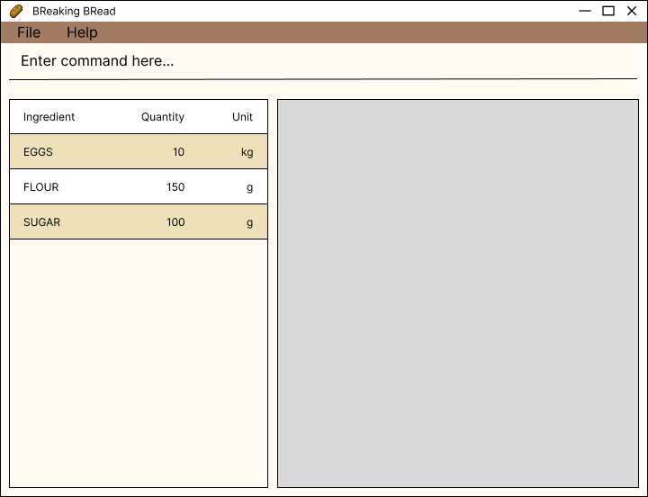

# [BA]king [BR]ead User Guide

[BA]king [BR]ead is a **desktop app for managing recipes and ingredient inventory, optimized for use via a 
Command Line Interface**(CLI) while still having the benefits of a Graphical User Interface (GUI). [BA]king [BR]ead is targeted
towards bakers like yourselves to aid you on your baking journey.
If you can type fast, [BA]king [BR]ead can get your ingredient and recipe management tasks done faster than traditional GUI apps.

<!-- * Table of Contents -->
<page-nav-print />

--------------------------------------------------------------------------------------------------------------------

## Quick start

1. Ensure you have Java `11` or above installed in your Computer.

2. Download the latest `bakingbread.jar` from [here](https://github.com/AY2324S1-CS2103T-F10-3/tp/releases).

3. Copy the file to the folder you want to use as the _home folder_ for your Inventory App.

4. Open a command terminal, `cd` into the folder you put the jar file in, and use the `java -jar bakingbread.jar` command to run the application. 
   A GUI similar to the below should appear in a few seconds. Note how the app contains some sample data. 
   

5. Type the command in the command box and press Enter to execute it. e.g. typing **`help`** and pressing Enter will open the help window. 
   Some example commands you can try:

    * add n/Flour q/10 u/kg (Add Command)
    * use n/Flour q/5 u/kg  (Use Command)
    * stock Flour           (Stock Command)

6. Refer to the [Features](#features) below for details of each command.

--------------------------------------------------------------------------------------------------------------------

## Features

<box type="info" seamless>

**Notes about the command format:** 

* Words in `UPPER_CASE` are the parameters to be supplied by the user. 
  e.g. in `add n/NAME`, `NAME` is a parameter which can be used as `add n/Milk`.

* Items with `…`​ after them can be used multiple times including zero times. 
  e.g. `[NAME]…​` can be used as ` ` (i.e. 0 times), `milk`, `milk flour` etc.

* Parameters can be in any order. 
  e.g. if the command specifies `n/NAME q/QUANTITY`, `q/QUANTITY n/NAME` is also acceptable.

* Parameters are case-insensitive.
* e.g. A parameter specified as `n/Milk` is functionally identical to `n/MILK` or `n/milk`.

* Extraneous parameters for commands that do not take in parameters (such as `help`, `exit` , `list` and `clear`) will be ignored. 
  e.g. if the command specifies `help 123`, it will be interpreted as `help`.

* If you are using a PDF version of this document, be careful when copying and pasting commands that span multiple lines as space characters surrounding line-breaks may be omitted when copied over to the application.
  </box>

### Viewing help : `help`

Shows a message explaining how to access the help page.

Format: `help`

### Adding an ingredient: `add`

Adds an ingredient to stock.

Format: `add n/NAME q/QUANTITY u/UNIT`

Examples:
* `add n/Flour q/1 u/kg`
* `add n/Milk q/600 u/ml`

### Using up ingredients : `use`

Depletes a specified amount of an ingredient from stock.

Format: `use n/NAME [q/QUANTITY] [u/UNIT]`

* If no quantity and unit is provided, the entire stock of the specified ingredient will be depleted.
* If the quantity depleted exceeds the current quantity in stock, the entire stock will be depleted but will not go into the negative.

Examples:
*  `use n/Milk q/600 u/ml` Depletes the current quantity of milk by 600 ml.
*  `use n/Egg` Fully depletes the current quantity of egg.

### Finding the quantity of an ingredient by name: `stock`

Lists the quantity of the specified ingredients.

Format: `stock [NAME]…​`

* Multiple ingredients can be specified e.g. `stock Flour Butter` will return the quantities of both ingredients
* If no ingredients are specified, the quantity of all ingredients will be returned
* Only full words will be matched e.g. `Flou` will not match `Flour`
* For ingredients with names comprising multiple words, the first word must be matched e.g. `Bay` will match `Bay Leaves` but `Leaves` will not

Examples:
* `stock Milk` returns `Milk: 100ml`
* `stock milk flour` returns `Milk: 100ml`, `Flour: 2000g` 

### Clearing all entries : `clear`

Clears all entries from the ingredient stock.

Format: `clear`

### Listing all Recipes : `list`

Lists out all recipes that is currently stored in [BA]king [BR]ead.

Format: `list`

Examples:
* `list` lists out all recipes within [BA]king [BR]ead
* 
### Viewing Specific Recipes : `view`

Views a specific recipe in [BA]king [BR]ead.

Format: `view UUID`
* `UUID` must be an integer greater than or equal to 1
* `UUID` integer value cannot exceed the total number of recipes loaded into the recipe book.
* to toggle back to listing all recipes, use the `list` command

Examples:
* `view 1` views the recipe with `UUID` of 1
* `view 21` views the recipe with `UUID` of 21

### Adding Recipes : `addrecipe`

Adds a new recipe to the recipe book. The new recipe will be put in view.

Format: `addrecipe n/NAME`

<box type="tip" seamless>

**Tip:** The added recipe will have an empty ingredient list and step list. These lists can be specified using the commands found in the **Modifying Recipes** section.
</box>

### Modifying Recipes `[coming in v1.3]`

### Deleting Recipes : `delete`

Deletes a specific recipe from [BA]king [BR]ead when you longer need it.

Format: `delete UUID`

* `UUID` must be an integer greater than or equal to 1
* `UUID` integer value cannot exceed the total number of recipes loaded into the recipe book

Examples:
* `delete 1` deletes the recipe with `UUID` of 1
* `delete 21` deletes the recipe with `UUID` of 21

### Searching Recipes : `search`

Searches for recipes that include a specific ingredient in the recipe.

Format: `search NAME`

* `NAME` cannot be empty
* `NAME` is not case-sensitive
*  If none of the recipes contain that ingredient, an empty recipe list will be displayed instead.

Examples:
* `search flour` searches for all recipes that uses `flour`
* `search butter` searches for all recipes that uses `butter`

### Exiting the program : `exit`

Exits the program.

Format: `exit`

### Saving the data

Inventory and Recipe data are saved in the hard disk automatically after any command that changes the data. There is no need to save manually.

### Editing the data file

Inventory data are saved automatically as a JSON file `[JAR file location]/data/inventory.json`. Advanced users are welcome to update data directly by editing that data file.

<box type="warning" seamless>

**Caution:**
If your changes to the data file makes its format invalid, Inventory will discard all data and start with an empty data file at the next run.  Hence, it is recommended to take a backup of the file before editing it.
</box>

--------------------------------------------------------------------------------------------------------------------

## FAQ

**Q**: How do I transfer my data to another Computer? 
**A**: Install the app in the other computer and overwrite the empty data file it creates with the file that contains the data of your previous [Br]eaking [Br]ead home folder.

--------------------------------------------------------------------------------------------------------------------

## Known issues
--------------------------------------------------------------------------------------------------------------------

## Command summary

| Action     | Format, Examples                                                     |
|------------|----------------------------------------------------------------------|
| **Add**    | `add n/NAME q/QUANTITY u/UNIT`   e.g., `add n/milk q/600 u/ml`    |
| **Clear**  | `clear`                                                              |
| **Use**    | `use n/NAME [q/QUANTITY] [u/UNIT]`  e.g., `use n/milk q/200 u/ml` |
| **Stock**  | `stock [NAME]…​`  e.g., `stock milk egg`                          |
| **List**   | `list`                                                               |
| **View**   | `view UUID`  e.g., `view 1`                                      |
| **Delete** | `delete UUID`  e.g., `delete 1`                                  |
| **Search** | `search NAME`  e.g., `search flour`                              |
| **Help**   | `help`                                                               |
| **Exit**   | `exit`                                                               |
