# [Ba]king [Br]ead User Guide
Welcome! If you are a new baker suffering under the mess and stress of baking, [Ba]king [Br]ead is here to help organise 
your kitchen and recipes.

[Ba]king [Br]ead will help you to:
1. Keep track of all your baking ingredients in your kitchen
2. Collate all your recipes digitally for easy viewing
3. Do all the above with blazing efficiency, your fast fingers and our application's command line interface makes this
uniquely possible.

You will never forget what Ingredient you need to stock up on during your next trip to the supermarket. You will never have to
flip through heavy physical recipe books any longer.
--------------------------------------------------------------------------------------------------------------------
## Table of Contents
* [Using this Guide](#using-this-guide)
* [Glossary](#glossary)
* [Quick Start](#quick-start)
* [Navigating the GUI](#navigating-the-gui)
* [Features](#features)
  * [Help](#viewing-help-help)
  * [Add ingredient](#adding-an-ingredient-add)
  * [Use ingredient](#using-up-ingredients-use)
  * [Find quantity of ingredient](#finding-the-quantity-of-an-ingredient-by-name-stock)
  * [Clear ingredient list](#clearing-all-entries-from-ingredient-stock-clear)
  * [View list of all recipes](#listing-all-recipes-list)
  * [View a recipe](#viewing-specific-recipes-view)
  * [Add a recipe](#adding-recipes-addrecipe)
  * [Modify a recipe](#modifying-recipes-modify)
  * [Search for recipes that have an ingredient](#searching-recipes-given-an-ingredient-search)
  * [Exit the program](#exiting-the-program-exit)
  * [Save the data](#saving-the-data)
  * [Edit the data file](#editing-the-data-file)
* [Common Errors](#common-possible-errors)
* [FAQ](#faq)
* [Command Summary](#command-summary)

<div style="page-break-after: always;"></div>

## Using this Guide
This user guide contains all the information you will need in order to use [Ba]king [Br]ead. For new users, this document will also guide you in using the application,
starting with the more essential features.

**For new users**:
- Start using [Ba]king [Br]ead by heading over to the [Quick Start](#quick-start) to learn how to set up the app and use it.

**For experienced users:**
- Utilise the [Table of Contents](#table-of-contents) to refresh your memory on the various features

Do take note of the following highlighted information panels as we will be using this throughout the User Guide.

<box type="info">

**Note:**
Used to highlight essential information
</box>

<box type="tip">

**Tip:**
Used to highlight helpful tips
</box>

<box type="warning">

**Caution:**
Used to highlight errors to look out for
</box>

## Glossary
Listed below are the definitions of the terminology used throughout the User Guide

| Term                                 | Definition                                                    | 
|:-------------------------------------|:--------------------------------------------------------------|
| GUI (Graphical User Interface)       | The visual interface of [Ba]king [Br]ead                      | 
| Command                              | A set of words that execute a certain operation               |
| Parameter                            | Specific input information that a command needs for it to run | 
| UUID (Universally Unique IDentifier) | An integer that is used to identify the recipes               |


## Quick start
New to [Ba]king [Br]ead? Not to worry, simply follow the instructions below to get started!

### Setting up [Ba]king [Br]ead
1. Ensure you have Java `11` or above installed in your Computer.

2. Download the latest `bakingbread.jar` from [here](https://github.com/AY2324S1-CS2103T-F10-3/tp/releases).

3. Copy the file to the folder you want to use as the _home folder_ for [Ba]king [Br]ead.

4. Open a command terminal, `cd` into the folder you put the jar file in, and use the `java -jar bakingbread.jar` command to run the application.<br>
   A GUI similar to the one below should appear in a few seconds. Note how the app contains some sample data.

### Navigating the GUI
The GUI may be confusing if you are a first time user of our application. Here is the breakdown of the GUI for [Ba]king [Br]ead.
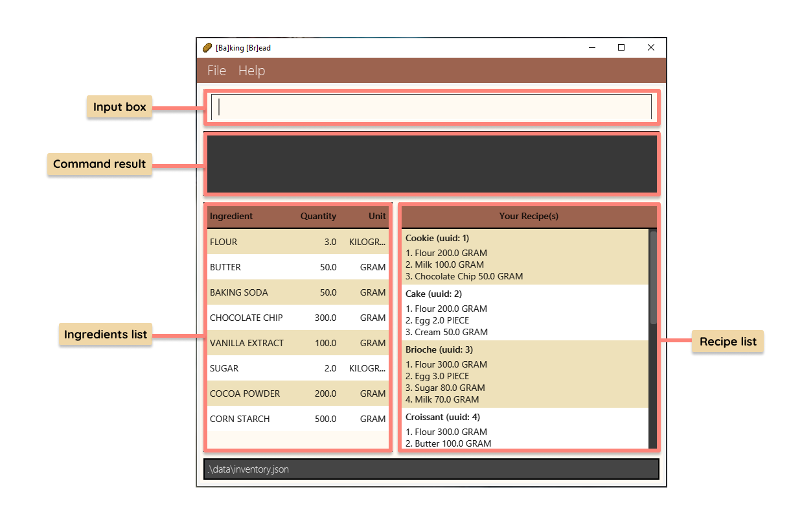<br>
**Input box:** This is where you will be inputting your commands.<br>
**Command result box:** Where the application will return a message regarding the outcome of command inputted.<br>
**Ingredients list:** Contain a list view of all your ingredients with their specified quantity and unit.<br>
**Recipe list:** Contains a list view of all your recipes.<br>

### Tutorial
#### Adding your first ingredient
Time to add your first ingredient! Take any ingredient from your kitchen, weigh the quantity of that ingredient and
let's get started!
1. Suppose you decided flour would be your first ingredient, and that you have 100 grams of flour. Type in the command 
into the application's input box as shown below.<br><br>
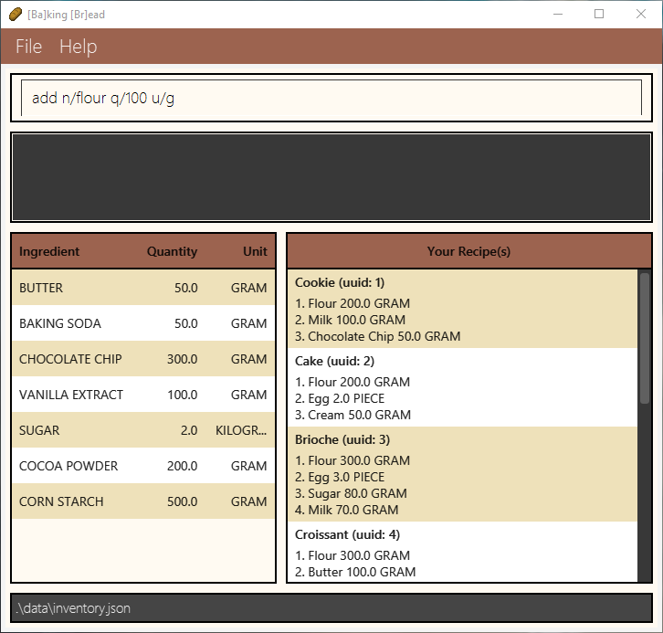 <br><br>
2. Press enter to execute the command
3. You should see the ingredient added into your ingredient list as seen below. Hooray! You have added your first ingredient!<br><br>
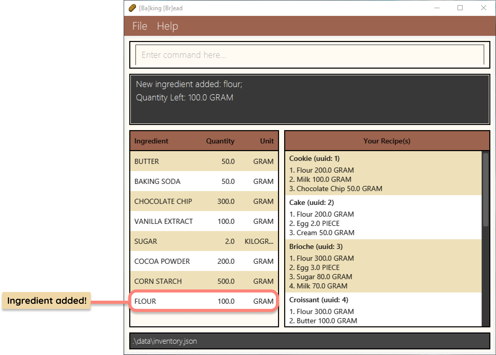

#### Adding your first recipe
Recipe adding is a little more complicated! But do not worry, you will get the hang of it in no time. Refer to the
infographic below for step-by-step instructions on adding your first recipe.

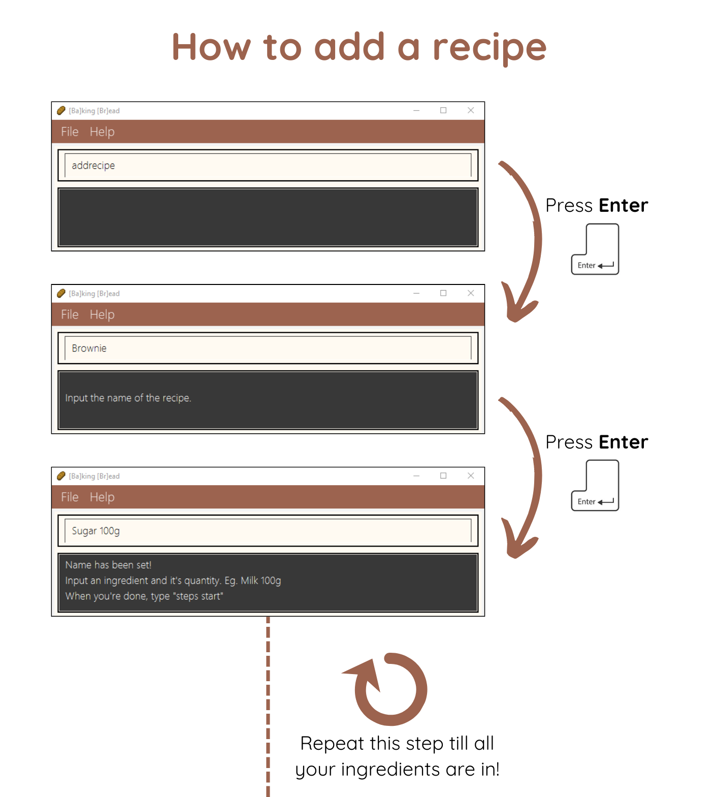
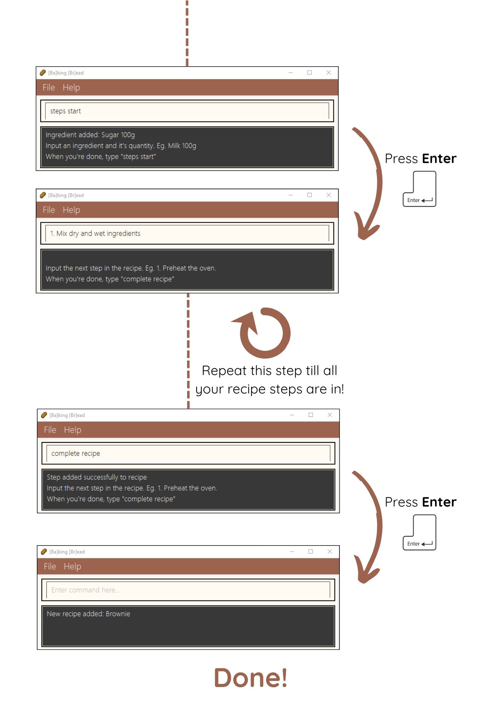

<box type="tip">

If you are stuck at any point, typing **`help`** and pressing Enter will open the help window to guide you along.
</box>

<box type="tip">

Refer to the [Features](#features) below for details of the other commands available!
</box>

--------------------------------------------------------------------------------------------------------------------
<div style="page-break-after: always;"></div>

## Features

<box type="info">

**Notes about the command format:**<br>

* Words in `UPPER_CASE` are the parameters to be supplied by the user.<br>
  e.g. in `add n/NAME`, `NAME` is a parameter which can be used as `add n/Milk`.

* Items with `…`​ after them can be used multiple times including zero times.<br>
  e.g. `[NAME]…​` can be used as ` ` (i.e. 0 times), `milk`, `milk flour` etc.

* Parameters can be in any order.<br>
  e.g. if the command specifies `n/NAME q/QUANTITY`, `q/QUANTITY n/NAME` is also acceptable.

* Parameters are case-insensitive.
  e.g. A parameter specified as `n/Milk` is functionally identical to `n/MILK` or `n/milk`.

* Extraneous parameters for commands that do not take in parameters (such as `help`, `exit` , `list` and `clear`) will be ignored.<br>
  e.g. if the command specifies `help 123`, it will be interpreted as `help`.

* If you are using a PDF version of this document, be careful when copying and pasting commands that span multiple lines as space characters surrounding line-breaks may be omitted when copied over to the application.
  </box>

#### List of parameters:

| Parameter |             Description             | Constraints                                      | Valid examples        | Invalid examples |
|:----------|:-----------------------------------:|--------------------------------------------------|-----------------------|------------------|
| `n/`      |       Name of the ingredient        | Alphanumeric characters (a to z, A to Z, 0 to 9) | Flour, Chocolate Chip | Chocolate-Chip   |
| `q/`      |     Quantity of the ingredient      | Must be numeric and more than 0                  | 1000, 1, 200          | -100, hundred, 0 |
| `u/`      | Unit used to measure the ingredient | Must be one of the supported units               | GRAM, KILOGRAM, PIECE | ML, L, TSP       |
| `i/`      |           UUID of recipe            | UUID must be at least 1                          | 1, 2, 3               | 0, -1, 0.1       |


#### Supported Units:

| Unit     | Alias                                 |
|----------|---------------------------------------|
| GRAM     | g, gram, GRAM                         |
| KILOGRAM | kg, kilogram, KILOGRAM                |
| PIECE    | pc, pcs, piece, pieces, PIECE, PIECES |


### Viewing help : `help`

If you are not sure how to use [Ba]king [Br]ead, this command will show a pop-up with a link to access the help page.


Format: `help`

<div style="page-break-after: always;"></div>

### Adding an ingredient: `add`

Adds an ingredient to the stock.

Format: `add n/NAME q/QUANTITY u/UNIT`

* If the ingredient already exists in the stock, using this command will add to the quantity specified for that 
  ingredient.

Restrictions:
* Units used must be supported.
* Quantity must be a positive number.
* If adding quantity to an ingredient that already exists, quantity conversions must be taken into account. If the unit 
  of the ingredient which is already in the stock is in GRAM/KILOGRAM, it cannot be converted to PIECE and vice versa.

Examples:
* `add n/Flour q/1 u/kg` adds 1kg of Flour to the stock.
* `add n/Milk q/600 u/g` adds 600g of Milk to the stock.

Example Used: `add n/Flour q/1 u/kg` **Note**: Sample data starts off with 3kg of Flour.


Example Used: `add n/Milk q/600 u/g` **Note**: Sample data does not contain Milk.

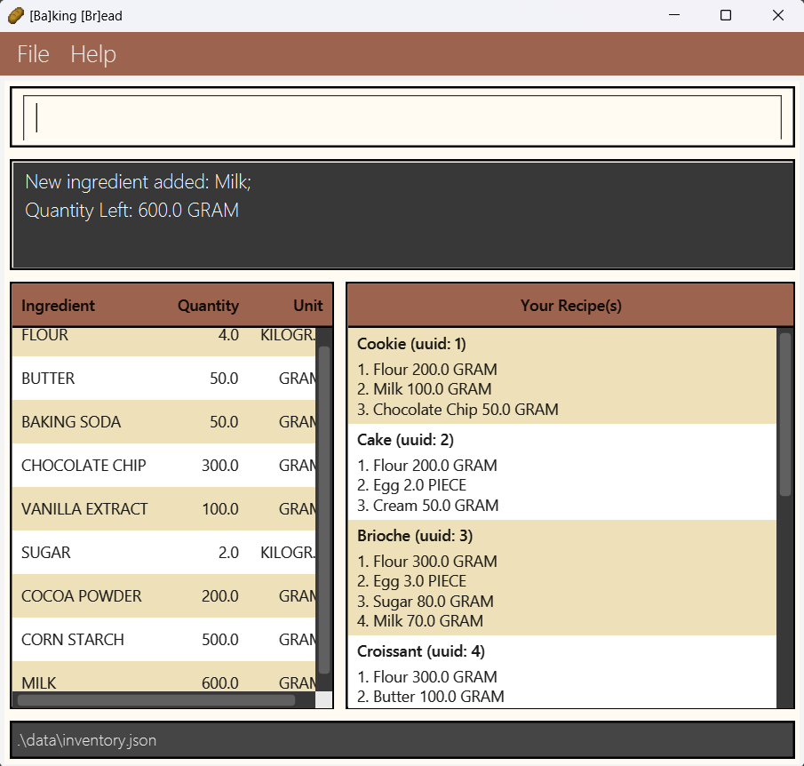

### Using up ingredients : `use`

Depletes a specified amount of an ingredient from the stock.

Format: `use n/NAME [q/QUANTITY] [u/UNIT]`

* If no quantity and unit is provided, the entire stock of the specified ingredient will be depleted.
* If the quantity depleted exceeds the current quantity in stock, the entire stock will be depleted but will not go into the negative.
* Note that the name **must** be exact. As such, `use butters` will not work if the ingredient list contains `butter`.

Restrictions:
* Units used must be supported.
* The quantity provided must be more than 0.
* When depleting the quantity of the ingredient, quantity conversions must be taken into account. If the unit
  of the ingredient that is in the stock is in GRAM/KILOGRAM, the use command cannot be inputted with the unit PIECE for that 
  specific ingredient and vice versa. For example, if the ingredient in the stock is 100g of Flour, `use n/flour q/50 u/pcs`
  would throw an error.
* When using up an ingredient, an error will be shown if the user inputs either the quantity or the unit. It is only 
  possible for both the unit and quantity to be stated or neither.

Examples:
*  `use n/Milk q/600 u/g` Depletes the current quantity of milk by 600g.
*  `use n/Egg` Fully depletes the current quantity of egg.

Example Used: `use n/Milk q/600 u/g` **Note**: Data shown started with 1kg of Milk.

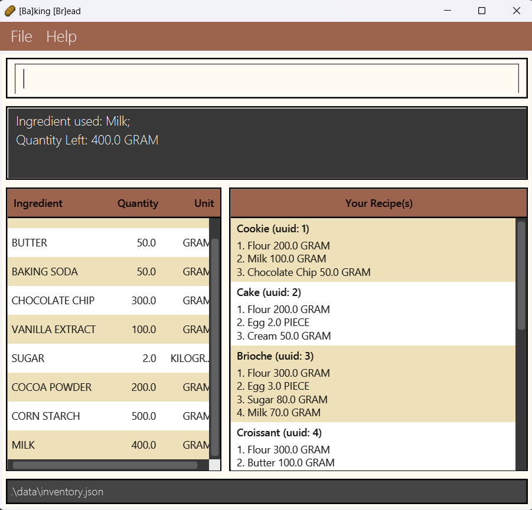

<box type="warning">

**Caution**: When encountering the error message `Ingredient does not exist in Inventory`, either add it in first or use a different ingredient
</box>

### Finding the quantity of an ingredient by name: `stock`

Lists the quantity of the specified ingredient(s).

Format: `stock [NAME]…​`

* Multiple ingredients can be specified e.g. `stock Flour Butter` will return the quantities of both ingredients.
* If no ingredients are specified, the quantity of all ingredients will be returned.
* Only full words will be matched e.g. `Flou` will not match `Flour`.
* For ingredients with names comprising multiple words, any ingredient that contains the keyword will also be displayed 
   <br/> e.g. `stock butter` will display both `butter` and `butter stick`.
* When no names are specified, all ingredients will be displayed.

Examples:
* `stock Butter` returns `Butter: 50g`.
* `stock Butter flour` returns `Butter: 100g`, `Flour: 2000g`.
* `stock` returns all ingredients.<br>

Example used: `stock butter`

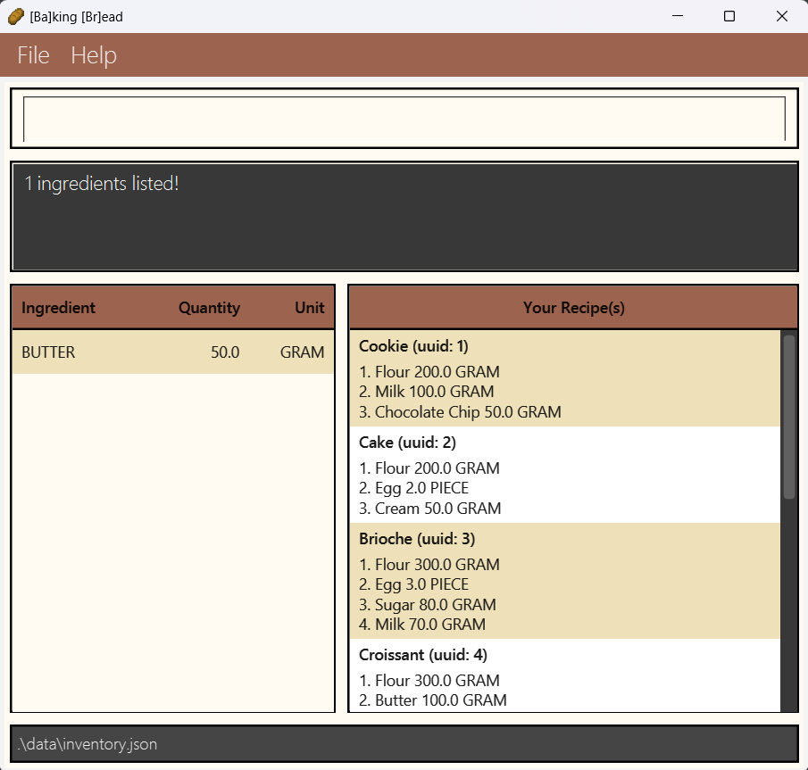

### Clearing all entries from ingredient stock : `clear`

Clears all entries from the ingredient stock.

Format: `clear`

Example used: `clear`


### Listing all Recipes : `list`

Lists out all recipes that is currently stored in [Ba]king [Br]ead.

Format: `list`

Example Used: `list`

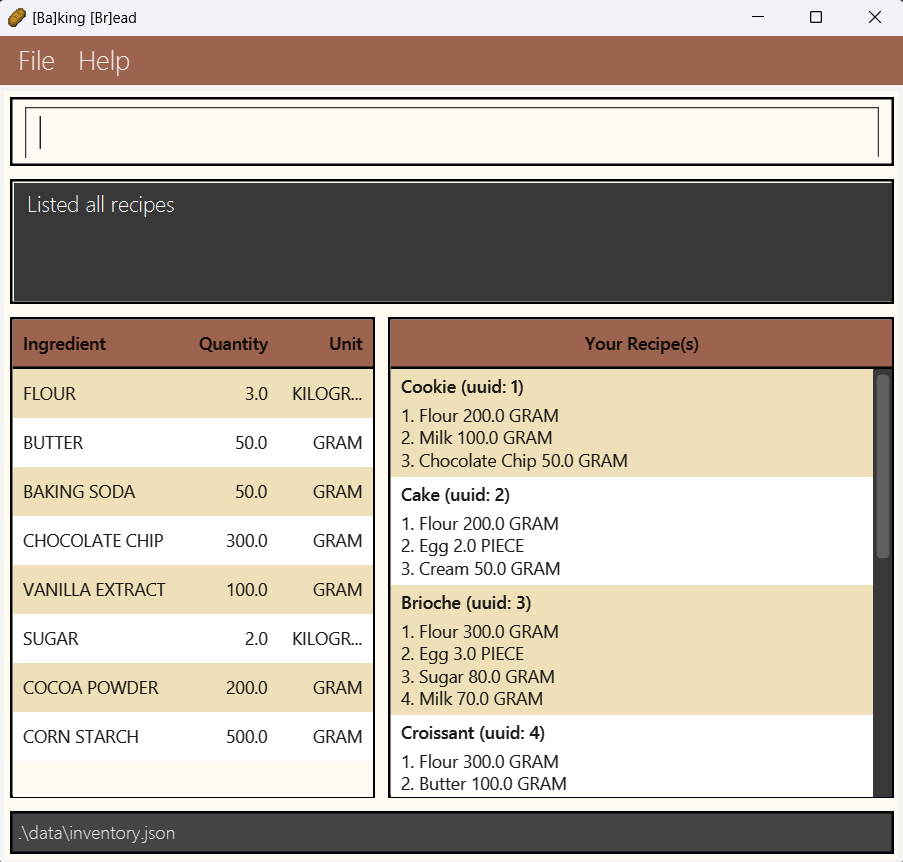

Examples:
* `list` lists out all recipes within [Ba]king [Br]ead.

### Viewing Specific Recipes : `view`

Views a specific recipe in [Ba]king [Br]ead.

Format: `view UUID`
* `UUID` must be an integer greater than or equal to 1.
* To toggle back to listing all recipes, use the `list` command.

Examples:
* `view 1` views the recipe with `UUID` of 1.
* `view 21` views the recipe with `UUID` of 21.

Example Used: `view 1`

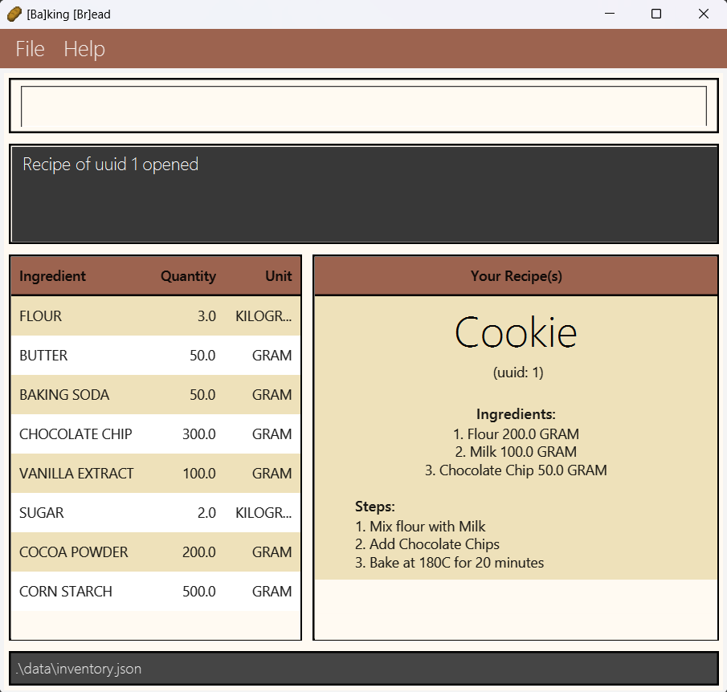

### Adding Recipes : `addrecipe`

Adds a new recipe to the recipe book. Each line in this command should be entered one by one.

Format: 
```
addrecipe 
NAME
(INGREDIENT_NAME) (INGREDIENT_QUANTITY)(INGREDIENT_UNIT)
⋮
steps start
1. STEP 1
2. STEP 2
⋮
complete recipe
```

* Name of Recipe needs to be of Alphanumeric format.
* Ingredients inputted **must** be of the format `(name) (quantity)(unit)` where an example is `flour 100g`.
* The quantity of the ingredient must be positive and the unit must be supported.
* For the recipe steps, the format to follow is `(index). (step)` where an example is `1. Mix Water and Flour`.
* For the recipe steps, you have to remember the index of step you are typing in and check it by yourself.

<box type="info">

**Note**: There is no error message when inputting negative quantities for ingredients. As such, it is up to the user to ensure
          that a positive quantity is inputted.
</box>

Example:
```
addrecipe
Bread
Water 100g
Flour 1kg
steps start
1. Mix Water and Flour
2. Bake at 180C
complete recipe
```


<box type="warning">

**Caution**: When encountering the error message `Failed to add ingredient`, ensure that the ingredient keyed in follows the following format **exactly** : `(NAME) (QUANTITY)(UNIT)` Example: `Milk 100g`
</box>

<box type="warning">

**Caution**: When encountering the error message `Failed to add step`, ensure that the index(A whole number) has been keyed been in before keying in the step itself<br>
      Example: `1. Mix Water and Flour` **Note**: Ensure that a period and space is present after the index.
</box>

<box type="warning">

**Caution:** As this function relies heavily on the user's input, please do check that your input is of the correct format.
</box>

### Modifying Recipes : `modify`

Modifies the ingredients in a recipe.

Format: `modify i/UUID n/NAME q/QUANTITY u/UNIT`
* `UUID` must be an integer greater than or equal to 1.
* The quantity provided must be more than 0.
* The unit used must be supported.

Example:
* Assuming flour is used in the recipe, `modify i/1 n/Flour q/100 u/g` modifies the quantity and unit of the `Flour` ingredient in the recipe.
* Assuming flour is not used in the recipe, `modify i/1 n/Flour q/100 u/g` adds the `Flour` ingredient with its quantity 
  and unit to the recipe.


<box type="info">

**Note**: After a recipe has been modified, it will be pushed to the bottom of the recipe list.
</box>


Example Used: `modify i/1 n/Flour q/100 u/g` 

**Note**: Recipe being modified has 200g of flour as part of the ingredient list


Example Used: `modify i/1 n/Cream q/100 u/g` 
**Note**: Recipe being modified does not have cream in its ingredient list

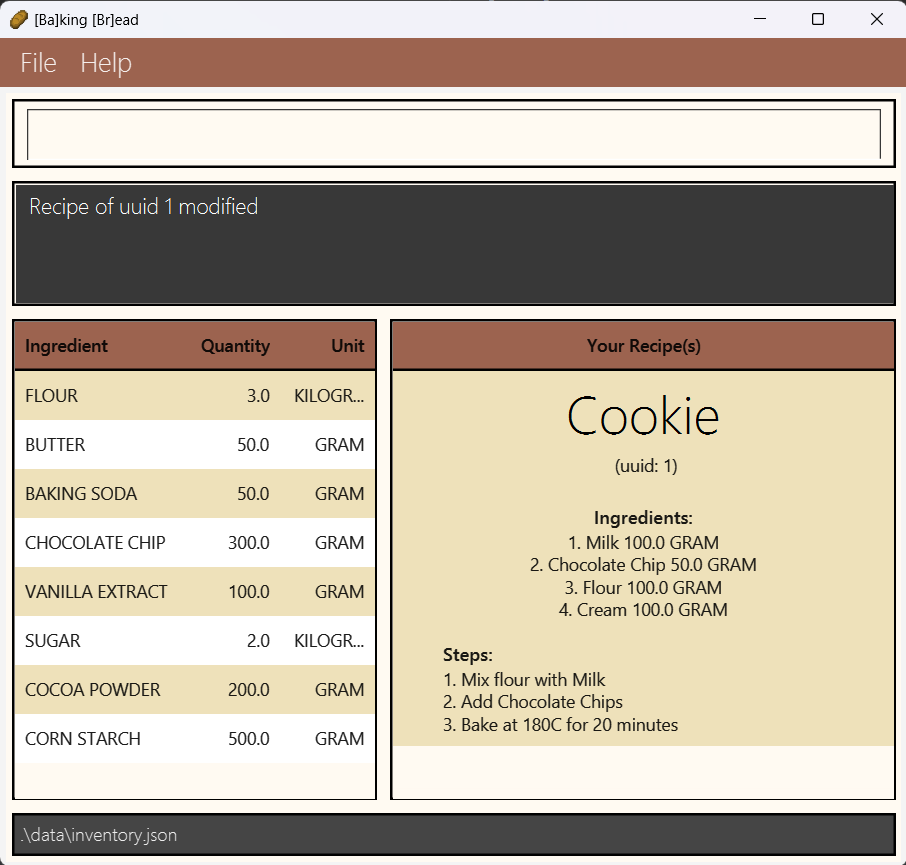

### Deleting Recipes : `delete`

Deletes a specific recipe from [Ba]king [Br]ead when you longer need it.

Format: `delete UUID`

* `UUID` must be an integer greater than or equal to 1.

Examples:
* `delete 1` deletes the recipe with `UUID` of 1.
* `delete 21` deletes the recipe with `UUID` of 21.

### Searching Recipes given an ingredient: `search`

Searches for recipes that includes a specific ingredient in the recipe.

Format: `search NAME`

* `NAME` cannot be empty.
* `NAME` is not case-sensitive.
*  If none of the recipes contain that ingredient, an empty recipe list will be displayed instead.
*  For ingredients with multiple words, `NAME` must be an **exact** match. As such, search chocolate will not display recipes
   that contain chocolate chip.

Examples:
* `search flour` searches for all recipes that uses `flour`
* `search butter` searches for all recipes that uses `butter`

Example used: `search flour`: **Note**: Multiple recipes use the ingredient flour

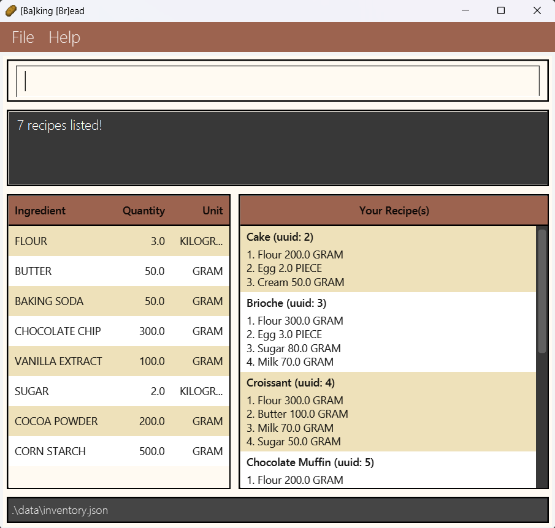


Example used: `search blueberry`: **Note**: Only one recipe uses the ingredient blueberry

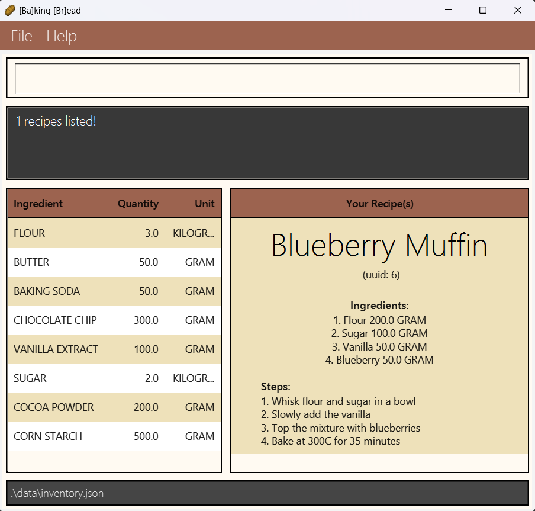

### Exiting the program : `exit`

Exits the program.

Format: `exit`

### Saving the data

Inventory and Recipe data are saved in the hard disk automatically after any command that changes the data. There is no need to save manually.

**Tip**: When the application loads for the first time and no command is run, no inventory or recipe data will be saved.

### Editing the data file

Inventory data are saved automatically as a JSON file `[JAR file location]/data/inventory.json`. Advanced users are welcome to update data directly by editing that data file.

<box type="warning" seamless>

**Caution:**
If your changes to the data file makes its format invalid, Inventory will discard all data and start with an empty data file at the next run.  Hence, it is recommended to take a backup of the file before editing it.
</box>

--------------------------------------------------------------------------------------------------------------------

### Common Possible Errors

| Error Message  | What to do  |
|-----------------------------------|---------------------------------------|
| Unknown command | Ensure that the command keyed in is one of the commands mentioned within this document|
| Invalid Command Format | Ensure that all parameters have keyed in and that none are left empty|
| Names should only contain alphanumeric characters and spaces, and it should not be blank | Ensure that only letters and numbers are used for names |
| Quantity has to be positive | Ensure that the quantity valued keyed in is **greater** than 0 |
| There is no recipe with the recipe UUID provided in the recipe book | Check the UUID of recipe attempting to use and ensure that it is correct|

--------------------------------------------------------------------------------------------------------------------

## FAQ

**Q**: How do I transfer my data to another Computer?<br>
**A**: Install the app in the other computer and overwrite the empty data file it creates with the file that contains the data of your previous [Ba]king [Br]ead home folder.

--------------------------------------------------------------------------------------------------------------------

## Command summary

**Note**: For `AddRecipe`, each command is to be run line and line.

| Action        | Format, Examples                                                                                                                                                                    |
|---------------|-------------------------------------------------------------------------------------------------------------------------------------------------------------------------------------|
| **Add**       | `add n/NAME q/QUANTITY u/UNIT` <br> e.g., `add n/milk q/600 u/g`                                                                                                                    |
| **Clear**     | `clear`                                                                                                                                                                             |
| **Use**       | `use n/NAME [q/QUANTITY] [u/UNIT]`<br> e.g., `use n/milk q/200 u/g`                                                                                                                 |
| **Stock**     | `stock [NAME]…​`<br> e.g., `stock milk egg`                                                                                                                                         |
| **List**      | `list`                                                                                                                                                                              |
| **View**      | `view UUID`<br/> e.g., `view 1`                                                                                                                                                     |
| **AddRecipe** | `addrecipe` `NAME QUANTITY…​` `steps start` `1. STEP 1` `complete recipe`<br/> e.g., `addrecipe` `Water 100g` `Flour 1kg` `steps start` `1. Mix Water with Flour` `complete recipe` |
| **Delete**    | `delete UUID`<br/> e.g., `delete 1`                                                                                                                                                 |
| **Search**    | `search NAME`<br/> e.g., `search flour`                                                                                                                                             |
| **Modify**    | `modify i/UUID n/NAME q/QUANTITY u/UNIT`<br/> e.g., `modify i/1 n/Flour q/100 u/g`                                                                                                  |
| **Help**      | `help`                                                                                                                                                                              |
| **Exit**      | `exit`                                                                                                                                                                              |
